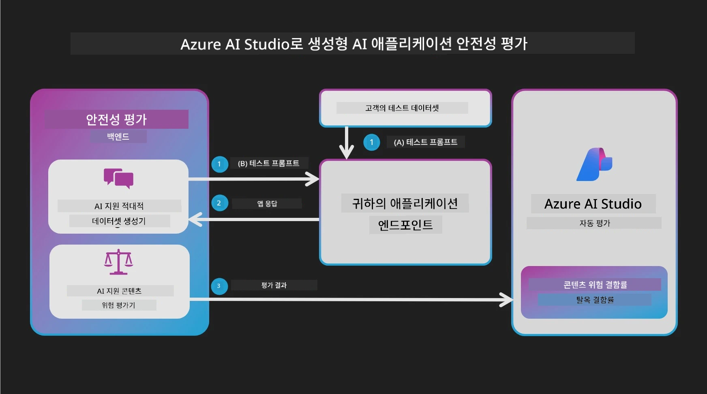

# 저장소 현지화 데모 (Co-op Translator + GitHub Actions)

작은 변경을 하고 있습니다

이 저장소는 문서 현지화를 자동화하는 **실시간 데모**로 구성되어 있습니다:

- Markdown 파일(e.g. `README.md`)을 편집합니다
- `main` 브랜치에 푸시합니다
- GitHub Actions가 Co-op Translator를 실행합니다
- 번역된 결과물이 `translations/<lang>/...` 경로에 생성/업데이트 됩니다
- 변경된 내용을 검토할 수 있도록 **Pull Request**가 열립니다

아래는 Co-op Translator 테스트 이미지입니다.

## 포함 내용

- **문서**: `README.md`, `docs/`
- **자동화**: `.github/workflows/co-op-translator.yml`

## 사전 준비 (GitHub Secrets)

**Settings → Secrets and variables → Actions**에서 다음을 추가하세요:

- **`OPENAI_API_KEY`**: OpenAI API 키

나중에 이미지 번역을 원한다면 Azure AI Vision 비밀 정보(선택사항)도 추가하고 `.github/workflows/translate.yml`에서 `-img` 옵션을 활성화하세요.

## 데모 흐름 (무대에서 할 일)

1. `README.md` (또는 `docs/` 내 파일)에서 한 줄을 편집합니다
2. 커밋하고 `main`에 푸시합니다
3. **Actions** 탭을 열어 워크플로 실행을 보여줍니다
4. 생성된 **Pull Request**를 엽니다
5. `translations/ko/` (및 활성화된 다른 언어) 아래 변경 사항을 보여줍니다

## 지원 언어

워크플로 기본 언어:

- 한국어: `ko`
- 일본어: `ja`
- 프랑스어: `fr`

변경하려면 `.github/workflows/co-op-translator.yml`에서 수정하세요.

## 참고 사항

- Co-op Translator 프로젝트: `https://github.com/Azure/co-op-translator`

---

<!-- CO-OP TRANSLATOR DISCLAIMER START -->
**면책 조항**:
본 문서는 AI 번역 서비스 [Co-op Translator](https://github.com/Azure/co-op-translator)를 사용하여 번역되었습니다. 정확성을 위해 노력하였으나, 자동 번역은 오류나 부정확한 부분을 포함할 수 있음을 유의하시기 바랍니다. 원문 문서가 권위 있는 출처로 간주되어야 합니다. 중요한 정보의 경우 전문 인력에 의한 번역을 권장합니다. 본 번역 사용으로 인해 발생하는 오해나 오해에 대해서는 책임을 지지 않습니다.
<!-- CO-OP TRANSLATOR DISCLAIMER END -->