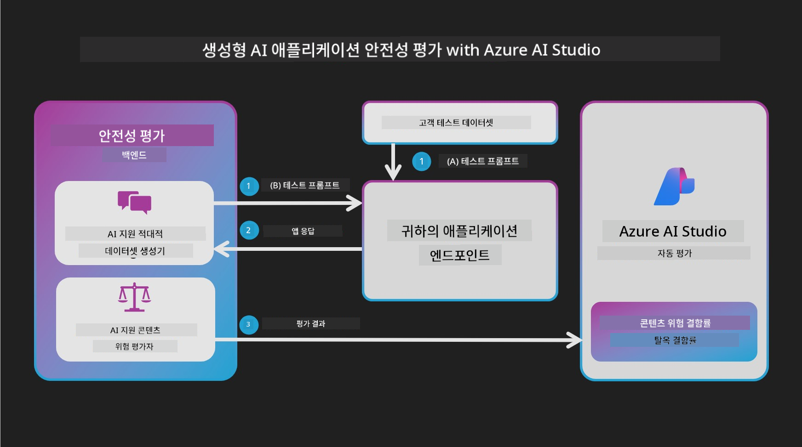

<!--
CO_OP_TRANSLATOR_METADATA:
{
  "original_hash": "0d0ac68ea25792bc2a6b708421cb52c9",
  "translation_date": "2026-01-09T12:28:16+00:00",
  "source_file": "README.md",
  "language_code": "ko"
}
-->
# 리포지토리 현지화 데모 (Co-op Translator + GitHub Actions)

이 리포지토리는 문서 현지화 자동화를 위한 **라이브 데모**로 설정되어 있습니다:

- Markdown 파일(예: `README.md`)을 수정합니다
- `main` 브랜치에 푸시합니다
- GitHub Actions가 Co-op Translator를 실행합니다
- 번역된 출력물이 `translations/<lang>/...` 경로에 생성/업데이트됩니다
- 변경 사항에 대해 **풀 리퀘스트**가 열려 리뷰가 가능합니다

아래는 Co-op Translator의 테스트 이미지입니다.

## 포함된 내용

- **문서**: `README.md`, `docs/`
- **자동화**: `.github/workflows/co-op-translator.yml`

## 사전 준비 (GitHub Secrets)

**Settings → Secrets and variables → Actions**에서 다음을 추가하세요:

- **`OPENAI_API_KEY`**: OpenAI API 키

나중에 이미지 번역을 원하면 Azure AI Vision 비밀 키도 추가(선택사항)하고 `.github/workflows/translate.yml`에서 `-img` 옵션을 활성화하세요.

## 데모 절차 (무대에서 할 일)

1. `README.md`(또는 `docs/` 내 파일)에서 한 줄을 수정합니다
2. 커밋 후 `main` 브랜치에 푸시합니다
3. **Actions** 탭을 열어 워크플로 실행을 보여줍니다
4. 생성된 **풀 리퀘스트**를 엽니다
5. `translations/ko/` (및 활성화된 다른 언어) 경로의 변경 사항을 보여줍니다

## 지원 언어

워크플로 기본 언어:

- 한국어: `ko`
- 일본어: `ja`
- 프랑스어: `fr`

`.github/workflows/co-op-translator.yml`에서 변경할 수 있습니다.

## 참고 사항

- Co-op Translator 프로젝트: `https://github.com/Azure/co-op-translator`

---

<!-- CO-OP TRANSLATOR DISCLAIMER START -->
**면책 조항**:  
이 문서는 AI 번역 서비스 [Co-op Translator](https://github.com/Azure/co-op-translator)를 사용하여 번역되었습니다. 정확성을 위해 노력하고 있으나, 자동 번역은 오류나 부정확성을 포함할 수 있다는 점을 유의하시기 바랍니다. 원문 문서는 해당 언어로 된 권위 있는 자료로 간주되어야 합니다. 중요한 정보의 경우 전문 인간 번역을 권장합니다. 이 번역의 사용으로 인한 오해나 잘못된 해석에 대해 당사는 책임을 지지 않습니다.
<!-- CO-OP TRANSLATOR DISCLAIMER END -->